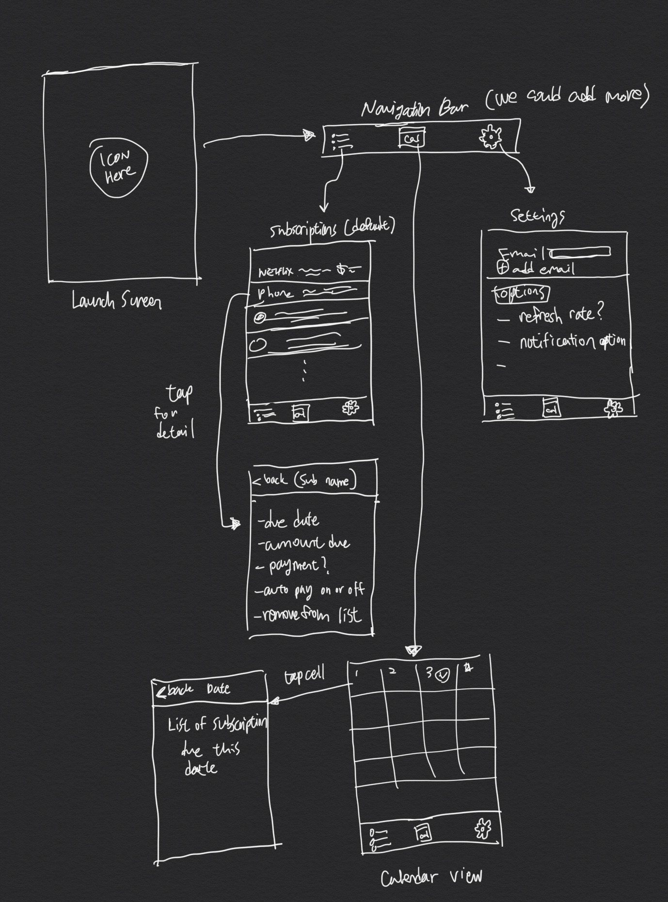

Group Project - README Template
===

# EzSub

## Table of Contents
1. [Overview](#Overview)
1. [Product Spec](#Product-Spec)
1. [Wireframes](#Wireframes)
2. [Schema](#Schema)

## Overview
### Description
Allows users to keep track of and manage all of their monthly subscriptions and recurring payments.

### App Evaluation
   - **Category:** Utility
   - **Mobile:** Many mobile apps use the subscription model. Being able to view all of your subscriptions on the mobile device you access these apps from can be very convenient
   - **Story:** Monthly subscription services are a essential part of our lives now. On top of basic utility bills such as electricity and phone bill, we pay monthly subscription for bunch of other servies. i.e. Netflix, Spotify, etc. This app could help the users keep track of the recurring payments
   - **Market:** Many people are subscribed to at least four or five monthly services these days, and most of them will be due on different days. This app will be appealing to the general public who are responsible for their own bills.
   - **Habit:** Knowing exactly how much money you owe each month can be extremely important, so users may want to check the app frequently to get the most up to date amount
   - **Scope:** V1 will allow users to setup accounts as well as add and view their subscriptions. V2 will allow users to see their subscriptions in a calendar view. V3 will allow users to receive notifications before payments are due.

## Product Spec

### 1. User Stories (Required and Optional)

**Required Must-have Stories**

* As a user, I should be able to create an account
* As a user, I should be able to add/drop emails to the account
* As a user, I should be able to sign in to my account
* As a user, I should be able to sign out of my account
* As a user, I should be able to see a list of my subscriptions
* As a user, I should be able to manually add/delete items from the list
* As a user, I should be able to see when each subscription payment is due
* As a user, I should be able to see how much money is due for each payment
* As a user, I should be able to delete a subscription from the app
* As a user, I should be able to see the total amount of money I pay each month
* As a user, I should have the option to add a subscription with a dynamic monthly payment
* As a user, I should have the option to create a subscription with a fixed monthly payment

**Optional Nice-to-have Stories**

* As a user, I should be notified before a subscription payment is due
* As a user, I should be able to toggle notifications on and off
* As a user, I should be able to click a link that opens a browser and directs me to a page which allows me to manage each of my subscriptions

### 2. Screen Archetypes

* Sign in page
   * As a user, I should be able to sign in to my account
* Register page
   * As a user, I should be able to create an account
* Subscription List Page
    * As a user, I should be able to see a list of my subscriptions
    * As a user, I should be able to see when each subscription payment is due
    * As a user, I should be able to see how much money is due for each payment
    * As a user, I should be able to delete a subscription from the app
    * As a user, I should be able to see the total amount of money I pay each month
* Add a subscription page
    * As a user, I should have the option to add a subscription with a dynamic monthly payment
    * As a user, I should have the option to create a subscription with a fixed monthly payment
* Settings Page
    * As a user, I should be able to sign out of my account
    * As a user, I should be notified before a subscription payment is due
    * As a user, I should be able to toggle notifications on and off

### 3. Navigation

**Tab Navigation** (Tab to Screen)

* Subscription list tab
* Calendar tab
* Settings tab

**Flow Navigation** (Screen to Screen)

* Sign in page
    * Register Page
    * Subscription List page

* Subscription List page
   * Add a subscription page
   * Subscription detail page
* Calendar View
    * Subscription detail page
* Settings page
    * Sign in page (on sign out)

## Wireframes

### [BONUS] Digital Wireframes & Mockups

### [BONUS] Interactive Prototype

## Schema 
[This section will be completed in Unit 9]
### Models
[Add table of models]
### Networking
- [Add list of network requests by screen ]
- [Create basic snippets for each Parse network request]
- [OPTIONAL: List endpoints if using existing API such as Yelp]
